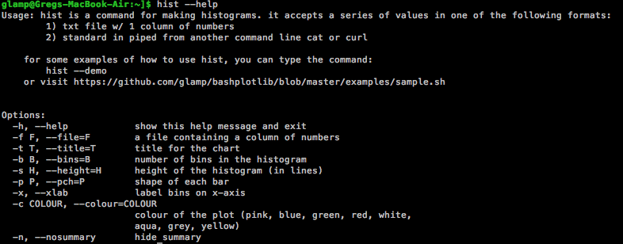
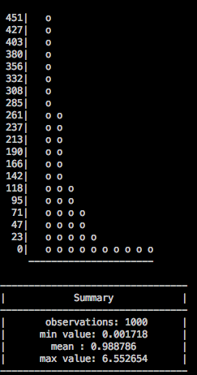

# bashplotlib
*plotting in the terminal*


## what is it?
bashplotlib is a python package and command line tool for making basic plots in the terminal. It's a quick way to visualize data when you don't have a GUI. It's written in pure python and can quickly be installed anywhere using pip.

## installation
### install with pip
```
$ pip install bashplotlib
```
### install from source
```
$ git clone git@github.com:glamp/bashplotlib.git
$ cd bashplotlib
$ python setup.py install
```

Either method will install the bashplotlib python package and will also add <code>hist</code> and <code>scatter</code> 
to your python scripts folder. This folder should be on your path (add it if it's not).

## features

- quick plotting from the command line
- customize the color, size, title, and shape of plots
- pipe data into plots with stdin


## usage
### command line
<code>hist</code> takes input from either stdin or specified using the -f parameter. Input should be a single column of numbers.

<code>scatter</code> takes x and y coordinates as input form either a comma delimited file using -f or from 2 different files using -x and -y.


### in python
If you want to use bashplotlib from python, just import histogram and scatterplot.
```
from bashplotlib.scatterplot import plot_scatter
```


```
from bashplotlib.histogram import plot_hist
```


## examples
```
$ scatter --file data/texas.txt --pch .
```


```
$ hist --file data/exp.txt
```


```
$ scatter -x data/x_test.txt -y data/y_test.txt
```


## todo

- sideways numbers for x-axis of histograms
- colors for individual points
- line charts
- trendlines


