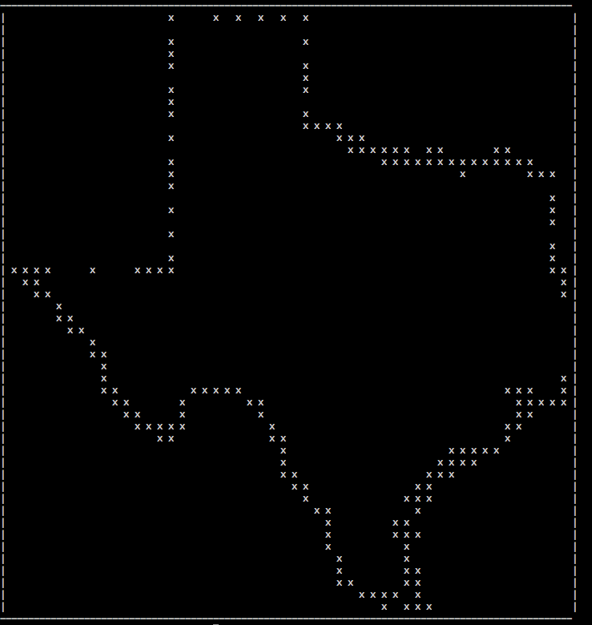

#bashplotlib
*plotting in the terminal*
  

##what is it?

bashplotlib is a python package and command line tool for making basic plots in the terminal. It's a quick way to visualize data when you don't have a GUI. It's written in pure python and can quickly be installed anywhere using pip.

##installation
<h5>install with pip</h5>
<pre>
	$ pip install bashplotlib
</pre>
<h5>install from source</h5>
<pre>
	$ git clone git@github.com:glamp/bashplotlib.git
	$ cd bashplotlib
	$ python setup.py install
</pre>

Either method will install the bashplotlib python package and will also add <code>hist</code> and <code>scatter</code> 
to your python scripts folder. This folder should be on your path (add it if it's not).

##features
<ul>
    <li>quick plotting from the command line</li>
    <li>customize the color, size, title, and shape of plots</li>
    <li>pipe data into plots with stdin</li>
</ul>

##usage
<h5>command line</h5>

<code>hist</code> takes input from either stdin or specified using the -f parameter. Input should be a single column of numbers.

<code>scatter</code> takes x and y coordinates as input form either a comma delimited file using -f or from 2 different files using -x and -y.

<h5>in python</h5>

If you want to use bashplotlib from python, just import histogram and scatterplot.

<pre>from bashplotlib.scatterplot import plot_scatter</pre>

<pre>from bashplotlib.histogram import plot_hist</pre>

##examples
<pre>$ scatter --file data/texas.txt --pch .</pre>

<pre>$ hist --file data/exp.txt</pre>

<pre>$ scatter -x data/x_test.txt -y data/y_test.txt</pre>

##todo
<ul>
	<li>sideways numbers for x-axis of histograms</li>
	<li>colors for individual points</li>
	<li>line charts</li>
	<li>trendlines</li>
</ul>

